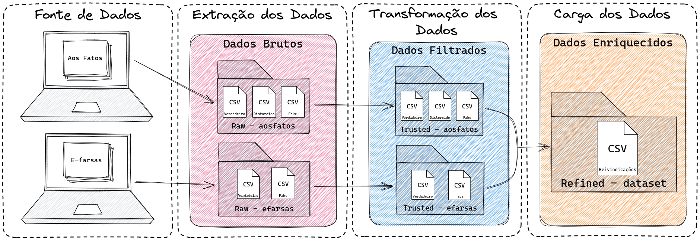

# Fake News Database

English Version | [Versão em Português](README.md) 

## Description

The Fake News Claims Database is a project developed for the Final Course Work (TCC) entitled "Creating a Fake News Dataset". This database was developed from fact-checking websites in the Portuguese language, providing relevant and categorized information.

## Research Method

The project followed the following research method, composed of the following steps:



## Origin and Collection

The database was built from collecting information from fact-checking websites. The sources used were:

- **Aos Fatos**: Brazilian fact-checking website. More information available at: [Aos Fatos](https://www.aosfatos.org/quem-somos/).
- **E-farsas**: Brazilian website for checking rumors and fake news. More information available at: [E-farsas](https://www.e-farsas.com/sobre/).

Data collection was performed until 06/25/2023, containing records from the period 04/02/2002 to 06/23/2023, covering a wide variety of news claims classified as `False`, `True`, and `Distorted` in different areas and topics. And it includes the necessary identification and categorization variables.

## Database Description

The Fake News Claims Database includes 5397 records, containing the following information (15 columns):

- `load_date`: Date of collection;
- `site_ranking`: Claim classification according to the site;
- `site_name`: Original source of the claim;
- `url`: URL of the site where the claim was collected;
- `site_language`: Language of the site where the collection was made;
- `site_content_url`: URL to the original claim;
- `site_url`: Link to the site where scraping was performed;
- `site_date_published`: Date the claim was published;
- `title`: Claim title;
- `description`: Claim description;
- `keywords`: Claim keywords;
- `tag`: Claim label;
- `claim_reviewed`: Reviewed claim;
- `review_body`: Review body;
- `claim`: Claim.

From the classifications, claims that were: **True**, **False**, and **Distorted** were chosen to work with. As can be seen, the following were collected:

- **True**: 550;
- **False**: 4802;
- **Distorted**: 45.

## Format

The dataset is available in CSV format and can be downloaded [here](data/filtered/refined_dataset/dataset.csv).

## Processing

The following processing steps were applied to the dataset:

- **Aos Fatos**:
  1. Data Cleaning: Removal of special characters and the string ` \| Aos Fatos`;
  2. Normalization: Conversion of the `site_date_published` column to date and time format.
- **E-farsas**:
  1. Data Cleaning: Removal of special characters and the string `- Publicidade -`;
  2. Normalization: Conversion of the `site_date_published` column to date and time format.

## License and Terms of Use

The Fake News Database is provided for academic and research purposes. You are free to use the data as long as you cite the original source and reference the TCC work "Creation of a Fake News Database". See the license file for more information.

## Usage Examples

Here's an example of how to access and use the database in Python:

```python
import pandas as pd

# Load the database
data = pd.read_csv('database.csv')

# Display the first few lines of the database
print(data.head())
